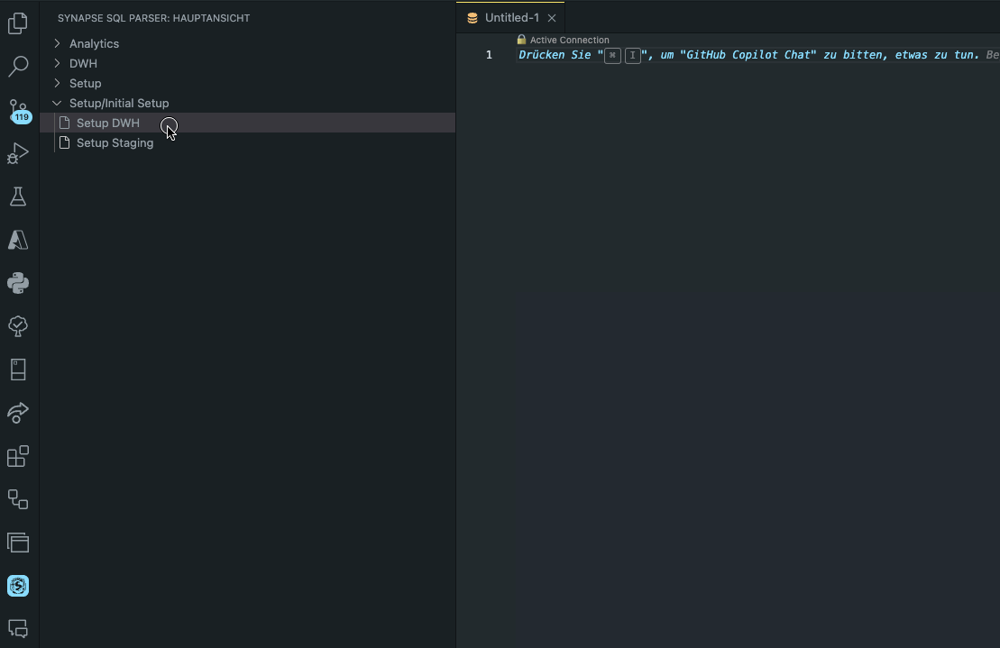

# Synapse SQL JSON Reader

The Synapse SQL JSON Reader is a Visual Studio Code extension that enhances workflows in Azure Synapse Studio by offering an integrated solution for managing SQL queries within JSON files. This tool is designed to streamline the process of extracting, editing, and persisting SQL queries directly from JSON documents, making it an indispensable asset for developers working with Azure Synapse Analytics.

## Features

- **Check SQL Header**: Automatically verifies the presence of a SQL header in your JSON file, ensuring your SQL queries are correctly formatted and easily identifiable.
- **Open Query in New Tab**: Provides the ability to open SQL queries from JSON files in a new editor tab, allowing for a more focused and convenient editing experience.
- **Save to JSON**: Enables you to save modifications made to SQL queries back into the original JSON file, ensuring that your changes are preserved and the document remains up-to-date.
- **Set Synapse sqlscripts Folder Path**: Configure the folder path for Synapse SQL scripts, allowing the extension to efficiently locate and manage SQL JSON files.
- **Get Synapse sqlscripts Folder Path**: Retrieve the currently configured path for Synapse SQL scripts, ensuring your environment is set up correctly.
- **Auto detect Synapse JSON**: Automatically identifying JSON documents containing SQL queries.

## Getting Started

1. **Configuration**: Use the command `extension.setFolderPath` to set the path to your Synapse sqlscripts folder.
2. **Usage**: Open a JSON file and use the provided commands via the command palette (Ctrl+Shift+P or Cmd+Shift+P on macOS) to manage your SQL queries. If the schema is correct the extension will detect it automatically 

# Usage
This extension integrates seamlessly into your existing VS Code workflow. Here's how to use its features:

- **Check SQL Header**: Open the command palette and type "Check SQL Header" to validate the SQL header in your JSON file.
- **Open Query in New Tab**: With a JSON file active, open the command palette and select "Open Query in New Tab" to edit the SQL query.
- **Save to JSON**: After editing, open the command palette and choose "Save to JSON" to update the JSON file with your changes.

# Keybindings

- Open Query in New Tab: **Ctrl+Alt+O** (or Cmd+Alt+O on macOS)
- Save to JSON: **Ctrl+Alt+S** (or Cmd+Alt+S on macOS)

# Contributing
Contributions to the Synapse SQL JSON Reader are welcome! Whether it's reporting bugs, suggesting features, or contributing to the code, please feel free to reach out or submit a pull request on GitHub.

# License
This project is licensed under the terms of the MIT license. See the LICENSE file for license rights and limitations.

We hope the Synapse SQL JSON Reader makes managing your SQL queries within JSON files a breeze. Happy coding!

## Acknowledgements

- [Azure Synapse Analytics](https://azure.microsoft.com/en-us/services/synapse-analytics/)
- [Visual Studio Code](https://code.visualstudio.com/)

## [Unreleased]

- 

## [0.2.0] 2024-02-18 
### Breaking
 
 - Language change of the header generator to english 

 ## Added

 - activity bar icon 
    - tree view JSON parser 
    - parse JSON to Synapse SQL view

## [0.1.0]

- restructuring